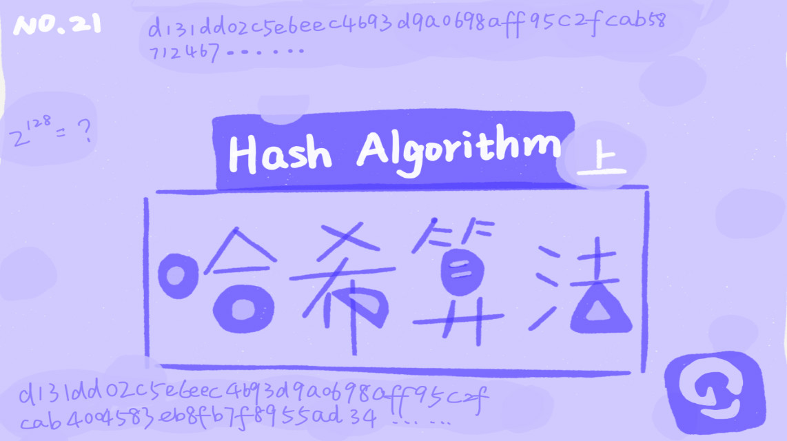

# 21. 哈希算法（上）：如何防止数据库中的用户信息被脱库？



还记得 2011 年 CSDN 的“脱库”事件吗？当时，CSDN 网站被黑客攻击，超过 600 万用户的注册邮箱和密码明文被泄露，很多网友对 CSDN 明文保存用户密码行为产生了不满。如果你是 CSDN 的一名工程师，你会如何存储用户密码这么重要的数据吗？仅仅 MD5 加密一下存储就够了吗？ 要想搞清楚这个问题，就要先弄明白哈希算法。

哈希算法历史悠久，业界著名的哈希算法也有很多，比如 MD5、SHA 等。在我们平时的开发中，基本上都是拿现成的直接用。所以，我今天不会重点剖析哈希算法的原理，也不会教你如何设计一个哈希算法，而是从实战的角度告诉你，在实际的开发中，我们该如何用哈希算法解决问题。

## 什么是哈希算法？

我们前面几节讲到“散列表”“散列函数”，这里又讲到“哈希算法”，你是不是有点一头雾水？实际上，不管是“散列”还是“哈希”，这都是中文翻译的差别，英文其实就是“Hash”。所以，我们常听到有人把“散列表”叫作“哈希表”“Hash 表”，把“哈希算法”叫作“Hash 算法”或者“散列算法”。那到底什么是哈希算法呢？

哈希算法的定义和原理非常简单，基本上一句话就可以概括了。**将任意长度的二进制值串映射为固定长度的二进制值串，这个映射的规则就是哈希算法，而通过原始数据映射之后得到的二进制值串就是哈希值**。但是，要想设计一个优秀的哈希算法并不容易，根据我的经验，我总结了需要满足的几点要求：

1. 从哈希值不能反向推导出原始数据（所以哈希算法也叫单向哈希算法）；
2. 对输入数据非常敏感，哪怕原始数据只修改了一个 Bit，最后得到的哈希值也大不相同；
3. 散列冲突的概率要很小，对于不同的原始数据，哈希值相同的概率非常小；
4. 哈希算法的执行效率要尽量高效，针对较长的文本，也能快速地计算出哈希值。

这些定义和要求都比较理论，可能还是不好理解，我拿 MD5 这种哈希算法来具体说明一下。

我们分别对“今天我来讲哈希算法”和“jiajia”这两个文本，计算 MD5 哈希值，得到两串看起来毫无规律的字符串（MD5 的哈希值是 128 位的 Bit 长度，为了方便表示，我把它们转化成了 16 进制编码）。可以看出来，无论要哈希的文本有多长、多短，通过 MD5 哈希之后，得到的哈希值的长度都是相同的，而且得到的哈希值看起来像一堆随机数，完全没有规律。

```java
MD5("今天我来讲哈希算法") = bb4767201ad42c74e650c1b6c03d78fa
MD5("jiajia") = cd611a31ea969b908932d44d126d195b
```

我们在前面也说了，通过哈希算法得到的哈希值，很难反向推导出原始数据。比如上面的例子中，我们就很难通过哈希值“a1fb91ac128e6aa37fe42c663971ac3d”反推出对应的文本“我今天讲哈希算法”。

哈希算法要处理的文本可能是各种各样的。比如，对于非常长的文本，如果哈希算法的计算时间很长，那就只能停留在理论研究的层面，很难应用到实际的软件开发中。比如，我们把今天这篇包含 4000 多个汉字的文章，用 MD5 计算哈希值，用不了 1ms 的时间。

哈希算法的应用非常非常多，我选了最常见的七个，分别是**安全加密、唯一标识、数据校验、散列函数、负载均衡、数据分片、分布式存储**。这节我们先来看前四个应用。

## 应用一：安全加密

说到哈希算法的应用，最先想到的应该就是安全加密。最常用于加密的哈希算法是 **MD5**（MD5 Message-Digest Algorithm，MD5 消息摘要算法）和 **SHA**（Secure Hash Algorithm，安全散列算法）。

除了这两个之外，当然还有很多其他加密算法，比如 **DES**（Data Encryption Standard，数据加密标准）、**AES**（Advanced Encryption Standard，高级加密标准）。

前面我讲到的哈希算法四点要求，对用于加密的哈希算法来说，有两点格外重要。第一点是很难根据哈希值反向推导出原始数据，第二点是散列冲突的概率要很小。

第一点很好理解，加密的目的就是防止原始数据泄露，所以很难通过哈希值反向推导原始数据，这是一个最基本的要求。所以我着重讲一下第二点。实际上，不管是什么哈希算法，我们只能尽量减少碰撞冲突的概率，理论上是没办法做到完全不冲突的。为什么这么说呢？

这里就基于组合数学中一个非常基础的理论，鸽巢原理（也叫抽屉原理）。这个原理本身很简单，它是说，如果有 10 个鸽巢，有 11 只鸽子，那肯定有 1 个鸽巢中的鸽子数量多于 1 个，换句话说就是，肯定有 2 只鸽子在 1 个鸽巢内。

有了鸽巢原理的铺垫之后，我们再来看，为什么哈希算法无法做到零冲突？

我们知道，哈希算法产生的哈希值的长度是固定且有限的。比如前面举的 MD5 的例子，哈希值是固定的 128 位二进制串，能表示的数据是有限的，最多能表示 2^128 个数据，而我们要哈希的数据是无穷的。基于鸽巢原理，如果我们对 2^128+1 个数据求哈希值，就必然会存在哈希值相同的情况。这里你应该能想到，一般情况下，哈希值越长的哈希算法，散列冲突的概率越低。

```java
2^128=340282366920938463463374607431768211456
```

为了让你能有个更加直观的感受，我找了两段字符串放在这里。这两段字符串经过 MD5 哈希算法加密之后，产生的哈希值是相同的。

.jpg)
.jpg)

不过，即便哈希算法存在散列冲突的情况，但是因为哈希值的范围很大，冲突的概率极低，所以相对来说还是很难破解的。像 MD5，有 2^128 个不同的哈希值，这个数据已经是一个天文数字了，所以散列冲突的概率要小于 1/2^128。

如果我们拿到一个 MD5 哈希值，希望通过毫无规律的穷举的方法，找到跟这个 MD5 值相同的另一个数据，那耗费的时间应该是个天文数字。所以，即便哈希算法存在冲突，但是在有限的时间和资源下，哈希算法还是很难被破解的。

除此之外，没有绝对安全的加密。越复杂、越难破解的加密算法，需要的计算时间也越长。比如 SHA-256 比 SHA-1 要更复杂、更安全，相应的计算时间就会比较长。密码学界也一直致力于找到一种快速并且很难被破解的哈希算法。我们在实际的开发过程中，也需要权衡破解难度和计算时间，来决定究竟使用哪种加密算法。

## 应用二：唯一标识

我先来举一个例子。如果要在海量的图库中，搜索一张图是否存在，我们不能单纯地用图片的元信息（比如图片名称）来比对，因为有可能存在名称相同但图片内容不同，或者名称不同图片内容相同的情况。那我们该如何搜索呢？

我们知道，任何文件在计算中都可以表示成二进制码串，所以，比较笨的办法就是，拿要查找的图片的二进制码串与图库中所有图片的二进制码串一一比对。如果相同，则说明图片在图库中存在。但是，每个图片小则几十 KB、大则几 MB，转化成二进制是一个非常长的串，比对起来非常耗时。有没有比较快的方法呢？

我们可以给每一个图片取一个唯一标识，或者说信息摘要。比如，我们可以从图片的二进制码串开头取 100 个字节，从中间取 100 个字节，从最后再取 100 个字节，然后将这 300 个字节放到一块，通过哈希算法（比如 MD5），得到一个哈希字符串，用它作为图片的唯一标识。通过这个唯一标识来判定图片是否在图库中，这样就可以减少很多工作量。

果还想继续提高效率，我们可以把每个图片的唯一标识，和相应的图片文件在图库中的路径信息，都存储在散列表中。当要查看某个图片是不是在图库中的时候，我们先通过哈希算法对这个图片取唯一标识，然后在散列表中查找是否存在这个唯一标识。

如果不存在，那就说明这个图片不在图库中；如果存在，我们再通过散列表中存储的文件路径，获取到这个已经存在的图片，跟现在要插入的图片做全量的比对，看是否完全一样。如果一样，就说明已经存在；如果不一样，说明两张图片尽管唯一标识相同，但是并不是相同的图片。

## 应用三：数据校验

电驴这样的 BT 下载软件你肯定用过吧？我们知道，BT 下载的原理是基于 P2P 协议的。我们从多个机器上并行下载一个 2GB 的电影，这个电影文件可能会被分割成很多文件块（比如可以分成 100 块，每块大约 20MB）。等所有的文件块都下载完成之后，再组装成一个完整的电影文件就行了。

我们知道，网络传输是不安全的，下载的文件块有可能是被宿主机器恶意修改过的，又或者下载过程中出现了错误，所以下载的文件块可能不是完整的。如果我们没有能力检测这种恶意修改或者文件下载出错，就会导致最终合并后的电影无法观看，甚至导致电脑中毒。现在的问题是，如何来校验文件块的安全、正确、完整呢？

具体的 BT 协议很复杂，校验方法也有很多，我来说其中的一种思路。

我们通过哈希算法，对 100 个文件块分别取哈希值，并且保存在种子文件中。我们在前面讲过，哈希算法有一个特点，对数据很敏感。只要文件块的内容有一丁点儿的改变，最后计算出的哈希值就会完全不同。所以，当文件块下载完成之后，我们可以通过相同的哈希算法，对下载好的文件块逐一求哈希值，然后跟种子文件中保存的哈希值比对。如果不同，说明这个文件块不完整或者被篡改了，需要再重新从其他宿主机器上下载这个文件块。

## 应用四：散列函数

前面讲了很多哈希算法的应用，实际上，散列函数也是哈希算法的一种应用。

我们前两节讲到，散列函数是设计一个散列表的关键。它直接决定了散列冲突的概率和散列表的性能。不过，相对哈希算法的其他应用，散列函数对于散列算法冲突的要求要低很多。即便出现个别散列冲突，只要不是过于严重，我们都可以通过开放寻址法或者链表法解决。

不仅如此，散列函数对于散列算法计算得到的值，是否能反向解密也并不关心。散列函数中用到的散列算法，更加关注散列后的值是否能平均分布，也就是，一组数据是否能均匀地散列在各个槽中。除此之外，散列函数执行的快慢，也会影响散列表的性能，所以，散列函数用的散列算法一般都比较简单，比较追求效率。

## 解答开篇

好了，有了前面的基础，现在你有没有发现开篇的问题其实很好解决？

我们可以通过哈希算法，对用户密码进行加密之后再存储，不过最好选择相对安全的加密算法，比如 SHA 等（因为 MD5 已经号称被破解了）。不过仅仅这样加密之后存储就万事大吉了吗？

字典攻击你听说过吗？如果用户信息被“脱库”，黑客虽然拿到是加密之后的密文，但可以通过“猜”的方式来破解密码，这是因为，有些用户的密码太简单。比如很多人习惯用 00000、123456 这样的简单数字组合做密码，很容易就被猜中。

那我们就需要维护一个常用密码的字典表，把字典中的每个密码用哈希算法计算哈希值，然后拿哈希值跟脱库后的密文比对。如果相同，基本上就可以认为，这个加密之后的密码对应的明文就是字典中的这个密码。（注意，这里说是的是“基本上可以认为”，因为根据我们前面的学习，哈希算法存在散列冲突，也有可能出现，尽管密文一样，但是明文并不一样的情况。）

针对字典攻击，我们可以引入一个盐（salt），跟用户的密码组合在一起，增加密码的复杂度。我们拿组合之后的字符串来做哈希算法加密，将它存储到数据库中，进一步增加破解的难度。不过我这里想多说一句，我认为安全和攻击是一种博弈关系，不存在绝对的安全。所有的安全措施，只是增加攻击的成本而已。

## 内容小结

今天的内容比较偏实战，讲到了哈希算法的四个应用场景，我们来回顾一下：

第一个应用是唯一标识，哈希算法可以对大数据做信息摘要，通过一个较短的二进制编码来表示很大的数据。

第二个应用是用于校验数据的完整性和正确性。

第三个应用是安全加密，我们讲到任何哈希算法都会出现散列冲突，但是这个冲突概率非常小。越是复杂哈希算法越难破解，但同样计算时间也就越长。所以，选择哈希算法的时候，要权衡安全性和计算时间来决定用哪种哈希算法。

第四个应用是散列函数，这个我们前面讲散列表的时候已经详细地讲过，它对哈希算法的要求非常特别，更加看重的是散列的平均性和哈希算法的执行效率。