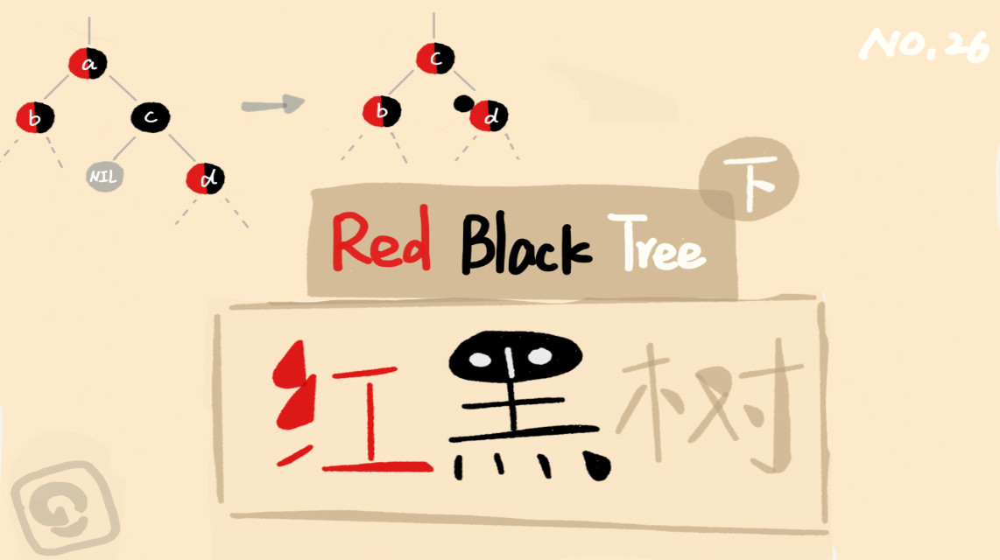
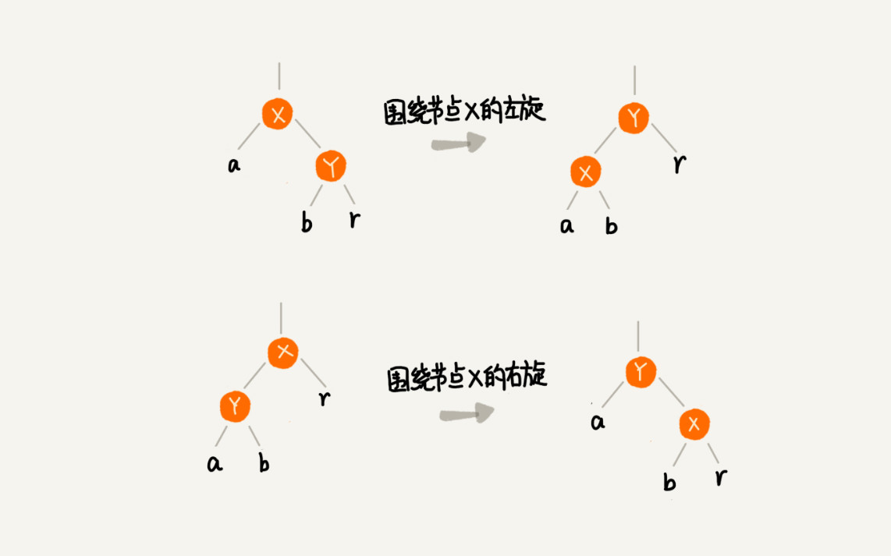
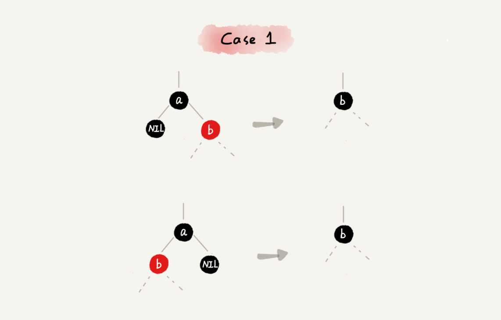
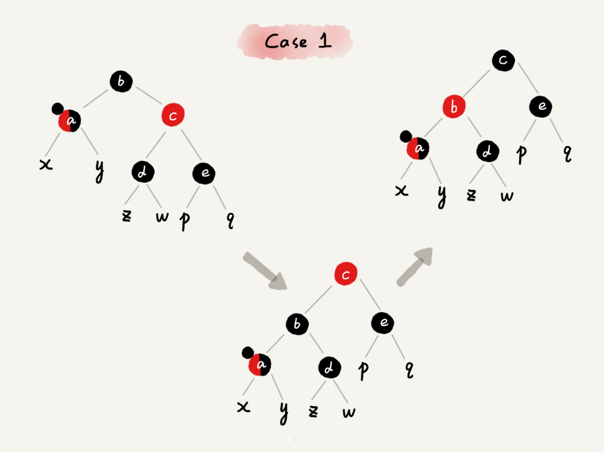
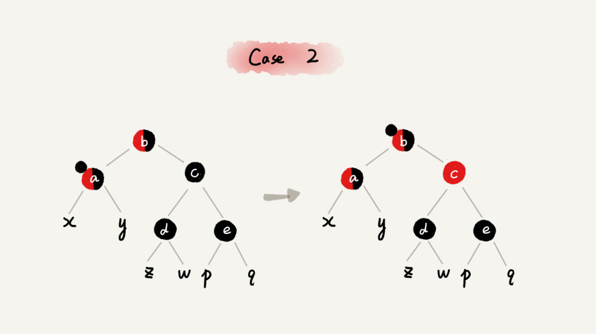
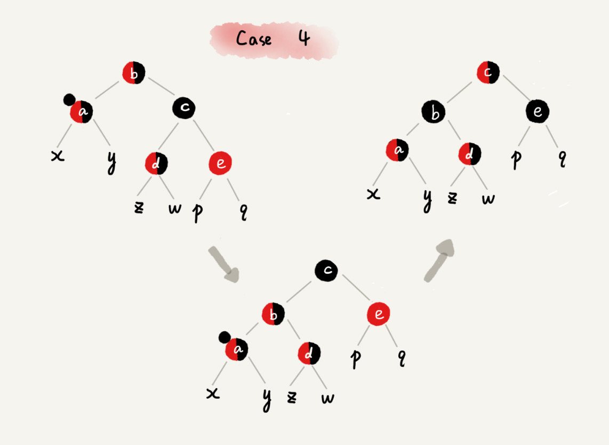
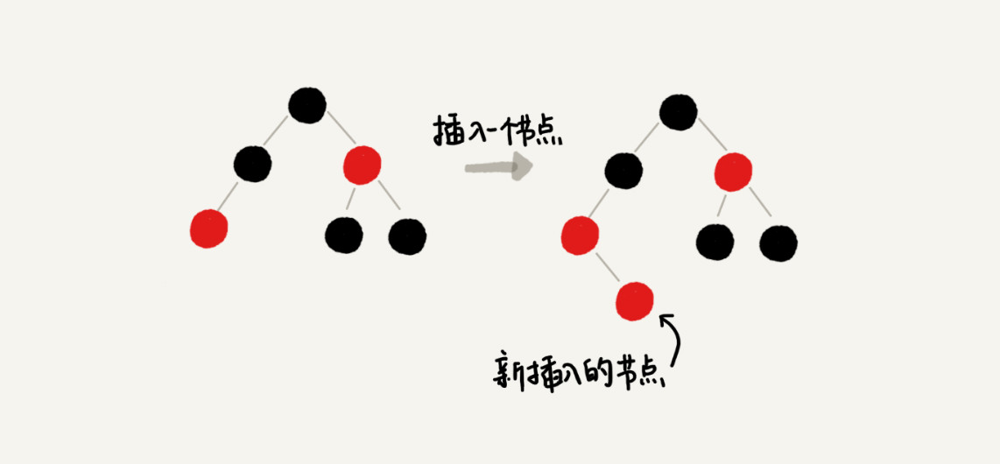

# 26. 红黑树（下）：掌握这些技巧，你也可以实现一个红黑树？

红黑树是一个让我又爱又恨的数据结构，“爱”是因为它稳定、高效的性能，“恨”是因为实现起来实在太难了。我今天讲的红黑树的实现，对于基础不太好的同学，理解起来可能会有些困难。但是，我觉得没必要去死磕它。

我为什么这么说呢？因为，即便你将左右旋背得滚瓜烂熟，我保证你过不几天就忘光了。因为，学习红黑树的代码实现，对于你平时做项目开发没有太大帮助。对于绝大部分开发工程师来说，这辈子你可能都用不着亲手写一个红黑树。除此之外，它对于算法面试也几乎没什么用，一般情况下，靠谱的面试官也不会让你手写红黑树的。

如果你对数据结构和算法很感兴趣，想要开拓眼界、训练思维，我还是很推荐你看一看这节的内容。但是如果学完今天的内容你还觉得懵懵懂懂的话，也不要纠结。我们要有的放矢去学习。你先把平时要用的、基础的东西都搞会了，如果有余力了，再来深入地研究这节内容。

好，我们现在就进入正式的内容。上一节，我们讲到红黑树定义的时候，提到红黑树的叶子节点都是黑色的空节点。当时我只是粗略地解释了，这是为了代码实现方便，那更加确切的原因是什么呢？ 我们这节就来说一说。

## 实现红黑树的基本思想

不知道你有没有玩过魔方？其实魔方的复原解法是有固定算法的：遇到哪几面是什么样子，对应就怎么转几下。你只要跟着这个复原步骤，就肯定能将魔方复原。

实际上，红黑树的平衡过程跟魔方复原非常神似，大致过程就是：**遇到什么样的节点排布，我们就对应怎么去调整**。只要按照这些固定的调整规则来操作，就能将一个非平衡的红黑树调整成平衡的。

还记得我们前面讲过的红黑树的定义吗？今天的内容里，我们会频繁用到它，所以，我们现在再来回顾一下。一棵合格的红黑树需要满足这样几个要求：

1. 根节点是黑色的；
2. 每个叶子节点都是黑色的空节点（NIL），也就是说，叶子节点不存储数据；
3. 任何相邻的节点都不能同时为红色，也就是说，红色节点是被黑色节点隔开的；
4. 每个节点，从该节点到达其可达叶子节点的所有路径，都包含相同数目的黑色节点。

在插入、删除节点的过程中，第三、第四点要求可能会被破坏，而我们今天要讲的“平衡调整”，实际上就是要把被破坏的第三、第四点恢复过来。

在正式开始之前，我先介绍两个非常重要的操作，**左旋**（rotate left）、**右旋**（rotate right）。左旋全称其实是叫**围绕某个节点的左旋**，那右旋的全称估计你已经猜到了，就叫**围绕某个节点的右旋**。

我们下面的平衡调整中，会一直用到这两个操作，所以我这里画了个示意图，帮助你彻底理解这两个操作。图中的 a，b，r 表示子树，可以为空。

前面我说了，红黑树的插入、删除操作会破坏红黑树的定义，具体来说就是会破坏红黑树的平衡，所以，我们现在就来看下，红黑树在插入、删除数据之后，如何调整平衡，继续当一棵合格的红黑树的。

## 插入操作的平衡调整

首先，我们来看插入操作。

**红黑树规定，插入的节点必须是红色的。而且，二叉查找树中新插入的节点都是放在叶子节点上**。所以，关于插入操作的平衡调整，有这样两种特殊情况，但是也都非常好处理。

### 1. 如果插入节点的父节点是黑色的，那我们什么都不用做，它仍然满足红黑树的定义。
### 2. 如果插入的节点是根节点，那我们直接改变它的颜色，把它变成黑色就可以了。

除此之外，其他情况都会违背红黑树的定义，于是我们就需要进行调整，调整的过程包含两种基础的操作：**左右旋转和改变颜色**。

红黑树的平衡调整过程是一个迭代的过程。我们把正在处理的节点叫做**关注节点**。关注节点会随着不停地迭代处理，而不断发生变化。最开始的关注节点就是新插入的节点。

新节点插入之后，如果红黑树的平衡被打破，那一般会有下面三种情况。我们只需要根据每种情况的特点，不停地调整，就可以让红黑树继续符合定义，也就是继续保持平衡。

我们下面依次来看每种情况的调整过程。提醒你注意下，为了简化描述，我把父节点的兄弟节点叫做叔叔节点，父节点的父节点叫做祖父节点。

**CASE 1：如果关注节点是 a，它的叔叔节点 d 是红色**，我们就依次执行下面的操作：

1. 将关注节点 a 的父节点 b、叔叔节点 d 的颜色都设置成黑色；
2. 将关注节点 a 的祖父节点 c 的颜色设置成红色；
3. 关注节点变成 a 的祖父节点 c；
4. 跳到 CASE 2 或者 CASE 3。

**CASE 2：如果关注节点是 a，它的叔叔节点 d 是黑色，关注节点 a 是其父节点 b 的右子节点**，我们就依次执行下面的操作：

1. 关注节点变成节点 a 的父节点 b；
2. 围绕新的关注节点b 左旋；
3. 跳到 CASE 3。

**CASE 3：如果关注节点是 a，它的叔叔节点 d 是黑色，关注节点 a 是其父节点 b 的左子节点**，我们就依次执行下面的操作：

1. 围绕关注节点 a 的祖父节点 c 右旋；
2. 将关注节点 a 的父节点 b、兄弟节点 c 的颜色互换。
3. 调整结束。

## 删除操作的平衡调整

红黑树插入操作的平衡调整还不是很难，但是它的删除操作的平衡调整相对就要难多了。不过原理都是类似的，我们依旧只需要根据关注节点与周围节点的排布特点，按照一定的规则去调整就行了。

删除操作的平衡调整分为两步，第一步是**针对删除节点初步调整**。初步调整只是保证整棵红黑树在一个节点删除之后，仍然满足最后一条定义的要求，也就是说，每个节点，从该节点到达其可达叶子节点的所有路径，都包含相同数目的黑色节点；第二步是**针对关注节点进行二次调整**，让它满足红黑树的第三条定义，即不存在相邻的两个红色节点。

### 1. 针对删除节点初步调整

这里需要注意一下，红黑树的定义中“只包含红色节点和黑色节点”，经过初步调整之后，为了保证满足红黑树定义的最后一条要求，有些节点会被标记成两种颜色，“红 - 黑”或者“黑 - 黑”。如果一个节点被标记为了“黑 - 黑”，那在计算黑色节点个数的时候，要算成两个黑色节点。

在下面的讲解中，如果一个节点既可以是红色，也可以是黑色，在画图的时候，我会用一半红色一半黑色来表示。如果一个节点是“红 - 黑”或者“黑 - 黑”，我会用左上角的一个小黑点来表示额外的黑色。

**CASE 1：如果要删除的节点是 a，它只有一个子节点 b**，那我们就依次进行下面的操作：

1. 删除节点 a，并且把节点 b 替换到节点 a 的位置，这一部分操作跟普通的二叉查找树的删除操作一样；
2. 节点 a 只能是黑色，节点 b 也只能是红色，其他情况均不符合红黑树的定义。这种情况下，我们把节点 b 改为黑色；
3. 调整结束，不需要进行二次调整。

**CASE 2：如果要删除的节点 a 有两个非空子节点，并且它的后继节点就是节点 a 的右子节点 c**。我们就依次进行下面的操作：

1. 如果节点 a 的后继节点就是右子节点 c，那右子节点 c 肯定没有左子树。我们把节点 a 删除，并且将节点 c 替换到节点 a 的位置。这一部分操作跟普通的二叉查找树的删除操作无异；
2. 然后把节点 c 的颜色设置为跟节点 a 相同的颜色；
3. 如果节点 c 是黑色，为了不违反红黑树的最后一条定义，我们给节点 c 的右子节点 d 多加一个黑色，这个时候节点 d 就成了“红 - 黑”或者“黑 - 黑”；
4. 这个时候，关注节点变成了节点 d，第二步的调整操作就会针对关注节点来做。

**CASE 3：如果要删除的是节点 a，它有两个非空子节点，并且节点 a 的后继节点不是右子节点**，我们就依次进行下面的操作：

1. 找到后继节点 d，并将它删除，删除后继节点 d 的过程参照 CASE 1；
2. 将节点 a 替换成后继节点 d；
3. 把节点 d 的颜色设置为跟节点 a 相同的颜色；
4. 如果节点 d 是黑色，为了不违反红黑树的最后一条定义，我们给节点 d 的右子节点 c 多加一个黑色，这个时候节点 c 就成了“红 - 黑”或者“黑 - 黑”；
5. 这个时候，关注节点变成了节点 c，第二步的调整操作就会针对关注节点来做。

### 2. 针对关注节点进行二次调整

经过初步调整之后，关注节点变成了“红 - 黑”或者“黑 - 黑”节点。针对这个关注节点，我们再分四种情况来进行二次调整。二次调整是为了让红黑树中不存在相邻的红色节点。

**CASE 1：如果关注节点是 a，它的兄弟节点 c 是红色的**，我们就依次进行下面的操作：

1. 围绕关注节点 a 的父节点 b 左旋；
2. 关注节点 a 的父节点 b 和祖父节点 c 交换颜色；
3. 关注节点不变；
4. 继续从四种情况中选择适合的规则来调整。

**CASE 2：如果关注节点是 a，它的兄弟节点 c 是黑色的，并且节点 c 的左右子节点 d、e 都是黑色的**，我们就依次进行下面的操作：

1. 将关注节点 a 的兄弟节点 c 的颜色变成红色；
2. 从关注节点 a 中去掉一个黑色，这个时候节点 a 就是单纯的红色或者黑色；
3. 给关注节点 a 的父节点 b 添加一个黑色，这个时候节点 b 就变成了“红 - 黑”或者“黑 - 黑”；
4. 关注节点从 a 变成其父节点 b；
5. 继续从四种情况中选择符合的规则来调整。

**CASE 3：如果关注节点是 a，它的兄弟节点 c 是黑色，c 的左子节点 d 是红色，c 的右子节点 e 是黑色**，我们就依次进行下面的操作：

1. 围绕关注节点 a 的兄弟节点 c 右旋；
2. 节点 c 和节点 d 交换颜色；
3. 关注节点不变；
4. 跳转到 CASE 4，继续调整。

**CASE 4：如果关注节点 a 的兄弟节点 c 是黑色的，并且 c 的右子节点是红色的**，我们就依次进行下面的操作：

1. 围绕关注节点 a 的父节点 b 左旋；
2. 将关注节点 a 的兄弟节点 c 的颜色，跟关注节点 a 的父节点 b 设置成相同的颜色；
3. 将关注节点 a 的父节点 b 的颜色设置为黑色；
4. 从关注节点 a 中去掉一个黑色，节点 a 就变成了单纯的红色或者黑色；
5. 将关注节点 a 的叔叔节点 e 设置为黑色；
6. 调整结束。

## 解答开篇

红黑树的平衡调整就讲完了，现在，你能回答开篇的问题了吗？为什么红黑树的定义中，要求叶子节点是黑色的空节点？

要我说，之所以有这么奇怪的要求，其实就是为了实现起来方便。只要满足这一条要求，那在任何时刻，红黑树的平衡操作都可以归结为我们刚刚讲的那几种情况。

还是有点不好理解，我通过一个例子来解释一下。假设红黑树的定义中不包含刚刚提到的那一条“叶子节点必须是黑色的空节点”，我们往一棵红黑树中插入一个数据，新插入节点的父节点也是红色的，两个红色的节点相邻，这个时候，红黑树的定义就被破坏了。那我们应该如何调整呢？

你会发现，这个时候，我们前面在讲插入时，三种情况下的平衡调整规则，没有一种是适用的。但是，如果我们把黑色的空节点都给它加上，变成下面这样，你会发现，它满足 CASE 2 了。

你可能会说，你可以调整一下平衡调整规则啊。比如把 CASE 2 改为“如果关注节点 a 的叔叔节点 b 是黑色或者不存在，a 是父节点的右子节点，就进行某某操作”。当然可以，但是这样的话规则就没有原来简洁了。

你可能还会说，这样给红黑树添加黑色的空的叶子节点，会不会比较浪费存储空间呢？答案是不会的。虽然我们在讲解或者画图的时候，每个黑色的、空的叶子节点都是独立画出来的。实际上，在具体实现的时候，我们只需要像下面这样，共用一个黑色的、空的叶子节点就行了。

## 内容小结

“红黑树一向都很难学”，有这种想法的人很多。但是我感觉，其实主要原因是，很多人试图去记忆它的平衡调整策略。实际上，你只需要能看懂我讲的过程，没有知识盲点，就算是掌握了这部分内容了。毕竟实际的软件开发并不是闭卷考试，当你真的需要实现一个红黑树的时候，可以对照着我讲的步骤，一点一点去实现。

现在，我就来总结一下，如何比较轻松地看懂我今天讲的操作过程。

第一点，**把红黑树的平衡调整的过程比作魔方复原，不要过于深究这个算法的正确性**。你只需要明白，只要按照固定的操作步骤，保持插入、删除的过程，不破坏平衡树的定义就行了。

第二点，**找准关注节点，不要搞丢、搞错关注节点**。因为每种操作规则，都是基于关注节点来做的，只有弄对了关注节点，才能对应到正确的操作规则中。在迭代的调整过程中，关注节点在不停地改变，所以，这个过程一定要注意，不要弄丢了关注节点。

第三点，**插入操作的平衡调整比较简单，但是删除操作就比较复杂**。针对删除操作，我们有两次调整，第一次是针对要删除的节点做初步调整，让调整后的红黑树继续满足第四条定义，“每个节点到可达叶子节点的路径都包含相同个数的黑色节点”。但是这个时候，第三条定义就不满足了，有可能会存在两个红色节点相邻的情况。第二次调整就是解决这个问题，让红黑树不存在相邻的红色节点。
